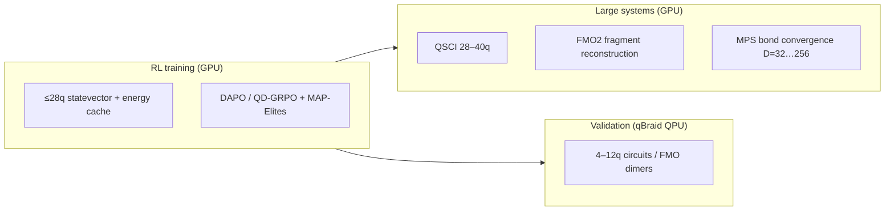

<p align="center">
  <h1 align="center">Conditional-GQE</h1>
  <p align="center">
    <strong>Scalable Generative Quantum Eigensolver with RL, QSCI, and FMO2</strong><br>
    Mitsubishi Chemical · AIST · NVIDIA CUDA-Q · qBraid
  </p>
  <p align="center">
    <a href="https://github.com/Quantum-Buddies/Conditional_GQE/blob/main/LICENSE"></a>
    <a href="https://www.python.org/downloads/"></a>
    <a href="https://pytorch.org/"></a>
    <a href="https://nvidia.github.io/cuda-quantum/"></a>
    <a href="https://huggingface.co/Ryukijano/h-cgqe-gic2026"></a>
  </p>
</p>

---

## What this is

**H-cGQE** (Hierarchical Conditional Generative Quantum Eigensolver) learns to **generate quantum circuits** for molecular ground-state energy estimation. A chemistry-conditioned Transformer proposes Pauli-word operator sequences; CUDA-Q evaluates energies; **DAPO/GRPO reinforcement learning** refines the policy from quantum feedback.

This repository implements the full hybrid stack for the **Quantum Materials Discovery Challenge** (Mitsubishi Chemical Group & AIST): scalable GQE on NVIDIA CUDA-Q, validation on **qBraid QPUs**, and extension to **~40-qubit parent systems** via **QSCI** and **FMO2** — not brute-force 40-qubit statevector simulation.

> **Model card:** [huggingface.co/Ryukijano/h-cgqe-gic2026](https://huggingface.co/Ryukijano/h-cgqe-gic2026)

---

## Challenge alignment

| Challenge goal | Our approach |
|---|---|
| Scalable GQE architecture | Transformer + DAPO RL + MAP-Elites (QD-GRPO) circuit library |
| ~40 qubits (ideal) or 20–30 qubits (acceptable) | **QSCI** + **MPS bond sweep** for full active spaces; **FMO2** for parent materials |
| Chemical accuracy (~1.6 mHa) where possible | Demonstrated on CH₃I (0.63 mHa); gated auxiliary RL rewards |
| Efficient hybrid workflow | Persistent energy cache (≤28q), L-BFGS-B θ optimization, qBraid batch QPU |
| Benchmarking vs classical / VQE | CUDA-Q GQE, ADAPT-VQE, exact diagonalization baselines |

### Scaling strategy (canonical)

Do **not** use full statevector simulation for RL training above ~28 qubits. It is too slow and scientifically the wrong tool for 32–40q JW-mapped chemistry circuits.



| Qubit range | Backend | Use case |
|---|---|---|
| **4–24q** | CUDA-Q `nvidia` (statevector) | RL rewards, cache, benchmarks, QPU prep |
| **24–28q** | CUDA-Q `nvidia` or `tensornet-mps` | Scaling demos; report MPS convergence |
| **28–40q** | **QSCI**, **FMO2**, MPS (bond sweep) | Challenge “40q” claims — not SV RL loops |
| **4–12q** | **qBraid QPU** | Hardware validation, shallow circuits only |

---

## Key results

| Experiment | Highlight |
|---|---|
| **CH₃I benchmark** | **0.63 mHa** vs CUDA-Q GQE (2.65 mHa) and HEA-VQE (988 mHa) |
| **IQM Emerald QPU** | 8q circuit, 87.5% HF-state fidelity (1024 shots) |
| **FMO2 (IMePh)** | Parent energy from 8q fragments; solver error 26 mHa |
| **QSCI scaling** | Benzene CAS(20e,20o) **40q** in ~19 s (MPS backend, bond convergence required) |
| **MPS** | Ethylene **28q** on single L40S (~300 s, D=32–256 sweep) |

Reference energies are **CASCI/FCI within the stated active space**, not full-molecule full-basis FCI. See [RESULTS.md](RESULTS.md) for full tables.

---

## Architecture

```
PySCF / OpenFermion          H-cGQE Transformer           CUDA-Q / qBraid
───────────────────          ──────────────────           ───────────────
molecule → JW Hamiltonian →  encoder (Hamiltonian)    →   observe / MPS / QSCI
active space → UCCSD pool →  decoder (operator seq)   →   L-BFGS-B θ opt
fragment plans (FMO)      →  DAPO RL + MAP-Elites     →   QPU submission
```

**Model (~8M params):** `d_model=256`, 4 encoder + 4 decoder layers, 8 heads, UCCSD operator pool (Jordan–Wigner mapped). Outputs sequences like `XYYX`, `IZII`, … — not energies directly.

**Collapse prevention:** UCCSD pool (no Z-only traps), BF16 policy, REPO advantages, curriculum learning, reward gating on HF improvement, Chemeleon2-style diversity (MMD + creativity + KL).

---

## Quick start (qBraid)

### 1. Clone and fetch LFS artifacts

```bash
git clone https://github.com/Quantum-Buddies/Conditional_GQE.git
cd Conditional_GQE
git lfs install
git lfs pull
```

**LFS artifacts on `main`:**

| File | Purpose |
|---|---|
| `results/train/h_cgqe_model_b200_sft.pt` | SFT warm-start checkpoint |
| `results/train/gqe_supervised_dataset.pt` | Supervised training dataset |
| `results/train/rl_energy_cache.sqlite` | 24k circuit→energy cache (4–28q) |

### 2. Environment

```bash
conda env create -f environment-dgx-spark-cudaq.yml
conda activate conditional-gqe-cudaq
pip install -r requirements-qbraid.txt
```

On qBraid Lab, use the **Launch on qBraid** button or:

[](https://account.qbraid.com?link=https://github.com/Quantum-Buddies/Conditional_GQE)

### 3. Smoke test

```bash
bash scripts/phase3/00_smoke_test.sh
```

### 4. Recommended workflow (qBraid GPU + QPU)

```bash
# RL training (uses energy cache — fast path)
bash scripts/launch_b200_training.sh ablation

# Evaluate generated circuits
python src/gqe/eval/evaluate_h_cgqe.py \
  --checkpoint results/train/h_cgqe_model_b200_rl_scratch.pt \
  --hamiltonians results/data/hamiltonians_gic2026/hamiltonians.json

# QPU preflight (simulator first — cheap)
python scripts/qpu_preflight.py --dry-run --device qbraid:qbraid:sim:qir-sv

# Submit shallow circuits to real QPU (≤12q)
bash scripts/run_hpc_qbraid_workflow.sh --qpu-submit
bash scripts/run_hpc_qbraid_workflow.sh --qpu-retrieve

# FMO2 parent reconstruction (materials scaling story)
bash scripts/phase3/04_run_fmo.sh

# QSCI / MPS scaling (28–40q write-up numbers)
bash scripts/phase3/05_run_mps.sh
bash scripts/phase3/09_run_qsci.sh
```

---

## Training launcher

Portable entry point: [`scripts/launch_b200_training.sh`](scripts/launch_b200_training.sh)

```bash
bash scripts/launch_b200_training.sh sft          # supervised warm-start
bash scripts/launch_b200_training.sh ablation       # RL from scratch (ablation)
bash scripts/launch_b200_training.sh cache          # precompute energy cache (≤28q only)
bash scripts/launch_b200_training.sh both           # SFT → RL main pipeline
```

**Energy cache:** SQLite-backed circuit→energy store for fast RL. Default cap **`CACHE_MAX_QUBITS=28`**. Do not precompute 32–40q SV caches — use QSCI/FMO2 instead.

```bash
# Optional: one-time cache fill (append-safe, skips existing keys)
bash scripts/launch_b200_training.sh cache
```

Blackwell / B200 env knobs: [`scripts/env_b200_blackwell.sh`](scripts/env_b200_blackwell.sh) (source before `import cudaq`).

---

## Datasets

| File | Molecules | Qubits | Purpose |
|---|---|---|---|
| `results/data/hamiltonians_gic2026/` | 35 | 4–28 | GIC challenge set |
| `results/data/hamiltonians_rl_b200/` | 51 | 4–40 | RL scaling curriculum |
| `results/data/hamiltonians_merged.json` | 21 | 4–40 | SFT + baselines |
| `results/data/fragments/fmo_hamiltonians.json` | — | 4–12 | FMO2 fragments |

Generate new Hamiltonians:

```bash
python src/gqe/data/generate_hamiltonians.py --help
```

---

## QPU guidelines (qBraid)

- Target **4–12 qubit** molecules for hardware (`h2`, `iodobenzene`, `imeph_cas12`).
- Preflight skips **ZNE** if two-qubit gates > 20; skips **REM** if qubits > 10.
- Use **Pauli expectation** energy (`cudaq.observe`), not raw state probability.
- **FMO dimers** (8–12q) are the best “large system + real QPU” story — not 40q full Hamiltonians on hardware.

```bash
python scripts/qpu_preflight.py --dry-run
python src/gqe/eval/submit_qpu.py --help
```

---

## Repository layout

```
Conditional_GQE/
├── README.md                          # This file
├── QUICKSTART.md                      # Short reproduction guide
├── AGENTS.md                          # Canonical training decisions
├── docs/B200_TRAINING_PLAN.md         # B200 / Blackwell notes
├── scripts/
│   ├── launch_b200_training.sh        # SFT / RL / cache launcher
│   ├── run_hpc_qbraid_workflow.sh      # HPC → QPU orchestration
│   └── phase3/                        # Experiment scripts (01–09)
├── src/gqe/
│   ├── models/                        # Transformer, train_rl_dapo.py
│   ├── eval/                          # evaluate, QSCI, FMO2, submit_qpu
│   ├── rl/                            # MAP-Elites, energy_cache
│   └── data/                          # Hamiltonians, precompute cache
└── results/
    ├── train/                         # Checkpoints (LFS), metrics, cache
    └── phase3_final/                  # Published experiment artifacts
```

---

## Safeguards

| Safeguard | What it prevents |
|---|---|
| `--gate-auxiliary-rewards` | Reward hacking without energy improvement |
| `--statevector-max-qubits 24` | GPU OOM on L40S |
| MPS bond sweep (D=32,64,128,256) | False accuracy from single bond dim |
| QPU preflight (ZNE/REM limits) | Infeasible mitigation on deep circuits |
| RL cache cap at 28q | Wasting GPU weeks on 32q+ SV observe loops |

---

## Hardware notes

| Platform | Statevector | MPS | QPU validation |
|---|---|---|---|
| **qBraid L40S** | ≤24q | 28q+ | Primary dev target |
| **qBraid B200** | ≤32q (reference only) | 28–40q | Optional local CUDA-Q |
| **AIRE 3× L40S** | ≤24q (MQPU task-parallel) | 28q | Slurm jobs |

> L40S is PCIe-only: keep `n_qubits ≤ 24` for `nvidia-mqpu` to avoid distributed statevector segfaults.

---

## Citation

```bibtex
@software{conditional_gqe,
  title  = {Conditional-GQE: Scalable Generative Quantum Eigensolver with RL, QSCI, and FMO2},
  author = {{Ryoushi Quantum Buddies}},
  url    = {https://github.com/Quantum-Buddies/Conditional_GQE},
  year   = {2026}
}
```

## License

[MIT](LICENSE) — © 2025–2026 Ryoushi Quantum Buddies

## Acknowledgments

NVIDIA CUDA-Q · Mitsubishi Chemical Group · AIST · qBraid · PySCF · OpenFermion · Park & Walsh (Chemeleon2, arXiv:2511.07158) · Nakaji et al. (GQE, arXiv:2401.09253)
