<p align="center">
  <h1 align="center">⚛️ Conditional-GQE (H-cGQE)</h1>
  <p align="center">
    <strong>AI-Driven Generative Quantum Circuit Design for Molecular & Materials Discovery</strong><br>
    <em>Generative AI × Reinforcement Learning × CUDA-Q × Quantum Hardware</em>
  </p>
  <p align="center">
    <strong>Mitsubishi Chemical Group & AIST Quantum Challenge (GIC 2026)</strong>
  </p>
  <p align="center">
    <a href="https://github.com/Quantum-Buddies/Conditional_GQE/blob/main/LICENSE"></a>
    <a href="https://www.python.org/downloads/"></a>
    <a href="https://pytorch.org/"></a>
    <a href="https://nvidia.github.io/cuda-quantum/"></a>
    <a href="https://huggingface.co/Ryukijano/h-cgqe-gic2026"></a>
    <a href="https://account.qbraid.com?gitHubUrl=https://github.com/Quantum-Buddies/Conditional_GQE.git"></a>
  </p>
</p>

<p align="center">
  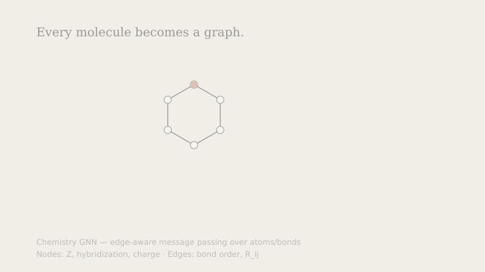
</p>

---

## 🌟 Executive Summary

**Conditional-GQE (H-cGQE)** is an artificial intelligence framework that **automatically designs quantum computing circuits** for chemistry and materials science. 

Traditional Quantum Virtual Eigensolvers (VQEs) rely on manual, human-designed quantum circuits that are either too deep for real quantum hardware or get trapped in mathematical dead-ends called **barren plateaus** and **diagonal collapse**. 

H-cGQE pairs a **Chemical Graph Neural Network (GNN)** and a **Transformer** with **Quality-Diversity Reinforcement Learning (QD-GRPO)** to amortize ansatz design: conditioned on molecular structure and the electronic Hamiltonian, the model proposes compact operator sequences whose continuous angles are refined classically (L-BFGS-B). The goal is chemical accuracy ($\le 1.6 \text{ mHa}$) within stated active spaces on simulators, with selective hardware checks.

```
┌────────────────────────┐      ┌────────────────────────┐      ┌────────────────────────┐
│   Molecular Structure  │ ───► │  AI Transformer Agent  │ ───► │ Compact Quantum Circuit│
│ (Atoms, Bonds, Energy) │      │ (GNN + QD-GRPO Policy) │      │ (Optimized for QPUs)   │
└────────────────────────┘      └────────────────────────┘      └────────────────────────┘
```

> 🔗 **Model Weights & Artifacts:** Hosted on HuggingFace at [`Ryukijano/h-cgqe-gic2026`](https://huggingface.co/Ryukijano/h-cgqe-gic2026)

---

## 🏆 Key Results & Benchmark Scores

| Benchmark / Molecule | Active Space / Qubits | Reported Metric | Baseline / Context | Highlight / Caveat |
|---|---|---|---|---|
| **Methyl Iodide ($\text{CH}_3\text{I}$)** | **8q** CAS(4e,4o) | **$0.63 \text{ mHa}$** vs active-space CASCI/FCI | $2.65 \text{ mHa}$ (CUDA-Q GQE)<br>$988 \text{ mHa}$ (HEA-VQE) | Sub-chemical accuracy ($\le 1.6 \text{ mHa}$) in a controlled 8q comparison (`results/phase3_final/benchmark_ch3i_consolidated.json`). Distinct from the larger GIC `methyl_iodide_cas12` Hamiltonian. |
| **Hydrogen ($\text{H}_2$)** | 4 Qubits | **$1.48 \text{ mHa}$** GPU↔AWS SV1 gap | Shot-noise simulator cross-check | Cross-backend energy discrepancy on a shallow circuit (`results/eval/simulator_validation.json`); **not** an FCI error. |
| **IQM Emerald QPU** | 8 Qubits | **$87.5\%$ state fidelity** | Ideal bitstring target | 1024-shot hardware run; fidelity is to the expected computational-basis string, **not** energy accuracy on QPU. |
| **Benzene ($\text{C}_6\text{H}_6$)** | **40q** (QSCI/MPS path) | QSCI subspace estimate (~**19 s**) | Full SV OOM / infeasible | Runtime scaling demonstration; **not** a claim of exact FCI/CASCI match. See `results/phase3_final/qsci/`. |
| **Ethylene ($\text{C}_2\text{H}_4$)** | **28 Qubits** | MPS bond-dim. sweep ($D=32\ldots256$) | Full SV stressful / often impractical | ~300 s single-GPU MPS convergence study; accuracy depends on bond dimension. |
| **GIC molecule suite** | 4q – 28q | Conditioned generation + collapse mitigations | Diagonal / commuting collapse is a known GQE failure mode | UCCSD pools + entanglement constraints are designed to suppress Z-only collapse. **Suite-wide chemical-accuracy rates should be reported from eval JSONs, not assumed 100%.** |

*Notes:* Chemical accuracy ≈ $1.6 \text{ mHa}$ ($\approx 1 \text{ kcal/mol}$). Where “exact” references appear below, they mean **CASCI/FCI within the stated active space**, not full CI in the complete basis. Held-out / zero-shot molecule generalization remains an open evaluation item.

---

## 📐 Visual Architecture & Dataflow

### Diagram 1 — End-to-End Pipeline (High-Level)

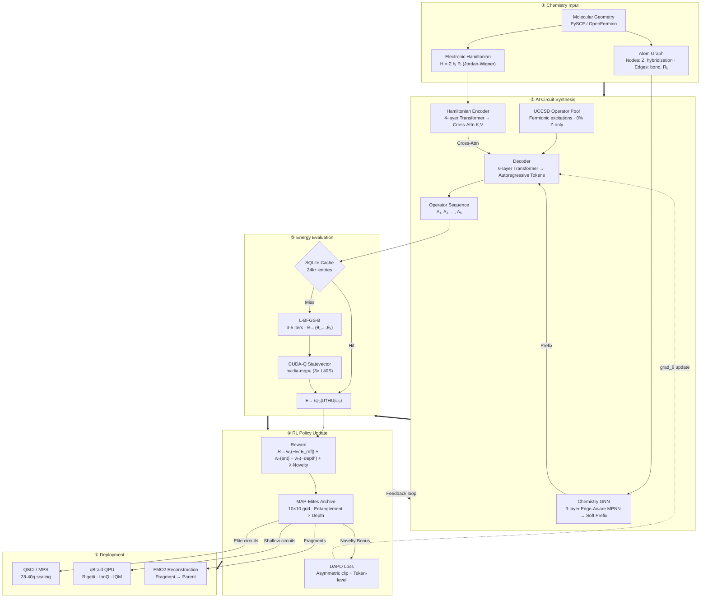
```mermaid
flowchart TD
    subgraph S1 ["① Chemistry Input"]
        direction TB
        Mol["Molecular Geometry<br/>PySCF / OpenFermion"]
        Ham["Electronic Hamiltonian<br/>H = Σ hₗ Pₗ  (Jordan-Wigner)"]
        Graph["Atom Graph<br/>Nodes: Z, hybridization · Edges: bond, Rᵢⱼ"]
        Mol --> Ham
        Mol --> Graph
    end

    subgraph S2 ["② AI Circuit Synthesis"]
        direction TB
        GNN["Chemistry GNN<br/>3-layer Edge-Aware MPNN → Soft Prefix"]
        HEnc["Hamiltonian Encoder<br/>4-layer Transformer → Cross-Attn K,V"]
        Dec["Decoder<br/>6-layer Transformer → Autoregressive Tokens"]
        Pool["UCCSD Operator Pool<br/>Fermionic excitations · 0% Z-only"]
        Graph --> GNN
        Ham --> HEnc
        Pool --> Dec
        GNN -->|"Prefix"| Dec
        HEnc -->|"Cross-Attn"| Dec
        Dec --> Seq["Operator Sequence<br/>A₁, A₂, ..., Aₖ"]
    end

    subgraph S3 ["③ Energy Evaluation"]
        direction TB
        Cache{"SQLite Cache<br/>24k+ entries"}
        LBFGS["L-BFGS-B<br/>3-5 iters · θ = (θ₁,...,θₖ)"]
        CUDAQ["CUDA-Q Statevector<br/>nvidia-mqpu (3× L40S)"]
        Seq --> Cache
        Cache -->|"Hit"| E["E = ⟨ψ₀|U†HU|ψ₀⟩"]
        Cache -->|"Miss"| LBFGS --> CUDAQ --> E
    end

    subgraph S4 ["④ RL Policy Update"]
        direction TB
        Reward["Reward<br/>R = w₁(−E/|E_ref|) + w₂(ent) + w₃(−depth) + λ·Novelty"]
        ME["MAP-Elites Archive<br/>10×10 grid · Entanglement × Depth"]
        DAPO["DAPO Loss<br/>Asymmetric clip + Token-level"]
        E --> Reward --> ME
        ME -->|"Novelty Bonus"| DAPO
        DAPO -.->|"grad_θ update"| Dec
    end

    subgraph S5 ["⑤ Deployment"]
        direction TB
        QSCI["QSCI / MPS<br/>28-40q scaling"]
        QPU["qBraid QPU<br/>Rigetti · IonQ · IQM"]
        FMO["FMO2 Reconstruction<br/>Fragment → Parent"]
        ME -->|"Elite circuits"| QSCI
        ME -->|"Shallow circuits"| QPU
        ME -->|"Fragments"| FMO
    end

    S1 ==> S2 ==> S3 ==> S4 ==> S5
    S4 -.->|"Feedback loop"| S2
```

### Diagram 2 — Internal Transformer Architecture (Technical)

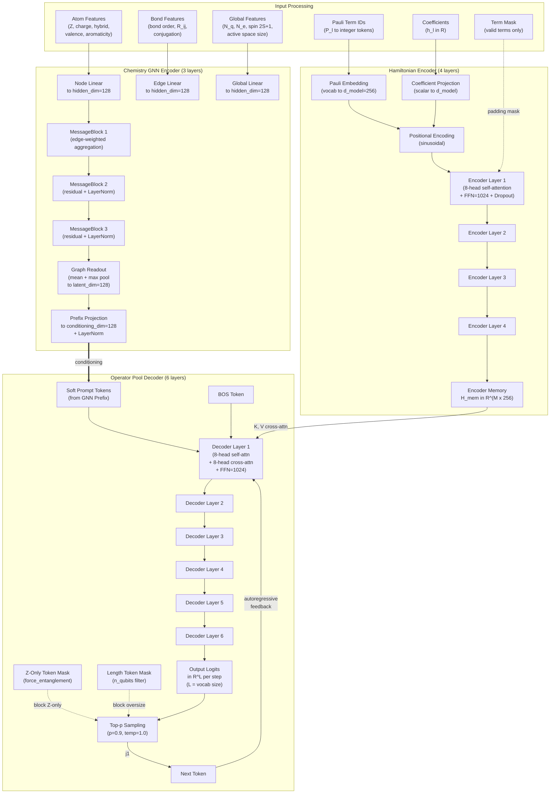
```mermaid
flowchart TD
    subgraph Input_Layer ["Input Processing"]
        Atoms["Atom Features<br>(Z, charge, hybrid,<br>valence, aromaticity)"]
        Bonds["Bond Features<br>(bond order, R_ij,<br>conjugation)"]
        Globals["Global Features<br>(N_q, N_e, spin 2S+1,<br>active space size)"]
        PauliIDs["Pauli Term IDs<br>(P_l to integer tokens)"]
        Coeffs["Coefficients<br>(h_l in R)"]
        TermMask["Term Mask<br>(valid terms only)"]
    end

    subgraph GNN_Layer ["Chemistry GNN Encoder (3 layers)"]
        NodeIn["Node Linear<br>to hidden_dim=128"]
        EdgeIn["Edge Linear<br>to hidden_dim=128"]
        GlobIn["Global Linear<br>to hidden_dim=128"]
        MP1["MessageBlock 1<br>(edge-weighted aggregation)"]
        MP2["MessageBlock 2<br>(residual + LayerNorm)"]
        MP3["MessageBlock 3<br>(residual + LayerNorm)"]
        Readout["Graph Readout<br>(mean + max pool<br>to latent_dim=128)"]
        Prefix["Prefix Projection<br>to conditioning_dim=128<br>+ LayerNorm"]
        Atoms --> NodeIn
        Bonds --> EdgeIn
        Globals --> GlobIn
        NodeIn --> MP1 --> MP2 --> MP3 --> Readout --> Prefix
    end

    subgraph HamEnc_Layer ["Hamiltonian Encoder (4 layers)"]
        PauliEmb["Pauli Embedding<br>(vocab to d_model=256)"]
        CoeffProj["Coefficient Projection<br>(scalar to d_model)"]
        PosEnc["Positional Encoding<br>(sinusoidal)"]
        EncL1["Encoder Layer 1<br>(8-head self-attention<br>+ FFN=1024 + Dropout)"]
        EncL2["Encoder Layer 2"]
        EncL3["Encoder Layer 3"]
        EncL4["Encoder Layer 4"]
        Mem["Encoder Memory<br>H_mem in R^(M x 256)"]
        PauliIDs --> PauliEmb
        Coeffs --> CoeffProj
        PauliEmb --> PosEnc
        CoeffProj --> PosEnc
        PosEnc --> EncL1 --> EncL2 --> EncL3 --> EncL4 --> Mem
        TermMask -.->|"padding mask"| EncL1
    end

    subgraph Decoder_Layer ["Operator Pool Decoder (6 layers)"]
        PrefixTokens["Soft Prompt Tokens<br>(from GNN Prefix)"]
        BOS["BOS Token"]
        DecL1["Decoder Layer 1<br>(8-head self-attn<br>+ 8-head cross-attn<br>+ FFN=1024)"]
        DecL2["Decoder Layer 2"]
        DecL3["Decoder Layer 3"]
        DecL4["Decoder Layer 4"]
        DecL5["Decoder Layer 5"]
        DecL6["Decoder Layer 6"]
        Logits["Output Logits<br>in R^L per step<br>(L = vocab size)"]
        Sample["Top-p Sampling<br>(p=0.9, temp=1.0)"]
        ZMask["Z-Only Token Mask<br>(force_entanglement)"]
        LenMask["Length Token Mask<br>(n_qubits filter)"]
        PrefixTokens --> DecL1
        BOS --> DecL1
        Mem -->|"K, V cross-attn"| DecL1
        DecL1 --> DecL2 --> DecL3 --> DecL4 --> DecL5 --> DecL6 --> Logits
        ZMask -.->|"block Z-only"| Sample
        LenMask -.->|"block oversize"| Sample
        Logits --> Sample
        Sample -->|"j1"| NextTok["Next Token"]
        NextTok -->|"autoregressive<br>feedback"| DecL1
    end

    Prefix ==>|"conditioning"| PrefixTokens
```

### Diagram 3 — RL Training Loop & Reward Decomposition

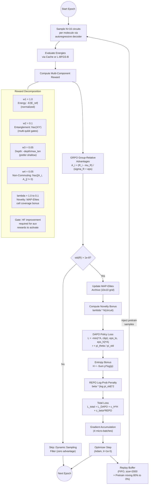
```mermaid
flowchart TD
    Start(("Start Epoch"))
    Sample["Sample N=16 circuits<br>per molecule via<br>autoregressive decoder"]
    Eval["Evaluate Energies<br>via Cache or L-BFGS-B"]
    Reward["Compute Multi-Component Reward"]
    Adv["GRPO Group-Relative<br>Advantages<br>A_i = (R_i - mu_R) / (sigma_R + eps)"]
    DynCheck{"std(R) > 1e-8?"}
    Skip["Skip: Dynamic Sampling<br>Filter (zero advantage)"]
    MEUpdate["Update MAP-Elites<br>Archive (10x10 grid)"]
    Novelty["Compute Novelty Bonus<br>lambda * N(circuit)"]
    DAPO["DAPO Policy Loss<br>L = -min(r*A, clip(r, eps_lo, eps_hi)*A)<br>r = pi_theta / pi_old"]
    Entropy["Entropy Bonus<br>H = -Sum p*log(p)"]
    REPO["REPO Log-Prob Penalty<br>beta * |log pi_old|^2"]
    Loss["Total Loss<br>L_total = L_DAPO + c_H*H + c_beta*REPO"]
    GradAcc["Gradient Accumulation<br>(4 micro-batches)"]
    Update["Optimizer Step<br>(Adam, lr=1e-5)"]
    Buffer["Replay Buffer<br>(FIFO, size=2000<br>+ Pretrain mixing 80% to 0%)"]
    Next(("Next Epoch"))

    Start --> Sample --> Eval --> Reward --> Adv --> DynCheck
    DynCheck -->|"No"| Skip --> Next
    DynCheck -->|"Yes"| MEUpdate --> Novelty
    Novelty --> DAPO
    DAPO --> Entropy --> REPO --> Loss
    Loss --> GradAcc --> Update
    Update --> Buffer
    Buffer -->|"inject pretrain<br>samples"| Sample
    Update --> Next

    subgraph Reward_Components ["Reward Decomposition"]
        R1["w1 = 1.0<br>Energy: -E/|E_ref|<br>(normalized)"]
        R2["w2 = 0.1<br>Entanglement: frac(X/Y)<br>(multi-qubit gates)"]
        R3["w3 = 0.05<br>Depth: -depth/max_len<br>(prefer shallow)"]
        R4["w4 = 0.05<br>Non-Commuting: frac([A_i, A_j] != 0)"]
        R5["lambda = 1.0 to 0.1<br>Novelty: MAP-Elites<br>cell coverage bonus"]
        R6["Gate: HF improvement<br>required for aux<br>rewards to activate"]
    end

    Reward --- Reward_Components
```

### Diagram 4 — VQE vs C-GQE Comparison

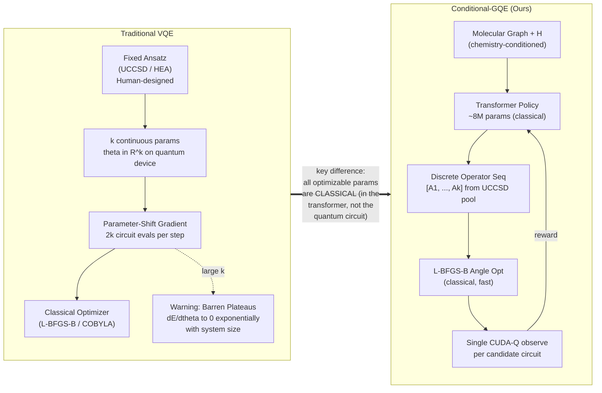
```mermaid
flowchart LR
    subgraph VQE ["Traditional VQE"]
        direction TB
        VAns["Fixed Ansatz<br>(UCCSD / HEA)<br>Human-designed"]
        VParam["k continuous params<br>theta in R^k on quantum device"]
        VGrad["Parameter-Shift Gradient<br>2k circuit evals per step"]
        VOpt["Classical Optimizer<br>(L-BFGS-B / COBYLA)"]
        VBP["Warning: Barren Plateaus<br>dE/dtheta to 0 exponentially<br>with system size"]
        VAns --> VParam --> VGrad --> VOpt
        VGrad -.->|"large k"| VBP
    end

    subgraph CGQE ["Conditional-GQE (Ours)"]
        direction TB
        CInput["Molecular Graph + H<br>(chemistry-conditioned)"]
        CAI["Transformer Policy<br>~8M params (classical)"]
        CSeq["Discrete Operator Seq<br>[A1, ..., Ak] from UCCSD pool"]
        CLBFGS["L-BFGS-B Angle Opt<br>(classical, fast)"]
        CEval["Single CUDA-Q observe<br>per candidate circuit"]
        CInput --> CAI --> CSeq --> CLBFGS --> CEval
        CEval -->|"reward"| CAI
    end

    VQE ==>|"key difference:<br>all optimizable params<br>are CLASSICAL (in the<br>transformer, not the<br>quantum circuit)"| CGQE
```

### Diagram 5 — Qubit Scaling Spectrum

```
  4q         12q         20q         28q         40q
  │           │           │           │           │
  ▼           ▼           ▼           ▼           ▼
┌─────┐   ┌─────┐    ┌─────┐    ┌─────┐    ┌─────┐
│ H₂  │   │ LiH │    │ N₂  │    │ C₂H₄│    │C₆H₆│
│ (4q)│   │(12q)│    │(20q)│    │(28q)│    │(40q)│
└──┬──┘   └──┬──┘    └──┬──┘    └──┬──┘    └──┬──┘
   │         │          │          │          │
   ▼         ▼          ▼          ▼          ▼
┌─────────────────────────────────────────────────────┐
│  CUDA-Q Statevector (nvidia-mqpu, 3× L40S)          │
│  ● Fast: <1s per circuit    ● RL training rewards   │
│  ● B200 SQLite Cache (24k+ entries)                 │
│  ● QPU Validation (qBraid: IQM, Rigetti)            │
└──────────────────────┬──────────────────────────────┘
                       │ 24q threshold (PCIe L40S)
                       ▼
┌─────────────────────────────────────────────────────┐
│  MPS Tensor Network (bond dim D=32…256)             │
│  ● Ethylene 28q: ~300s on single L40S               │
│  ● Bond convergence sweep required for accuracy     │
└──────────────────────┬──────────────────────────────┘
                       │ 28q threshold
                       ▼
┌─────────────────────────────────────────────────────┐
│  QSCI + FMO2 (28–40q)                               │
│  ● Benzene 40q: ~19s QSCI/MPS path (subspace estimate) │
│  ● FMO2: fragment → evaluate → reassemble parent    │
│  ● NOT brute-force statevector (scientifically wrong│
│    for 32–40q JW chemistry circuits)                │
└─────────────────────────────────────────────────────┘
```

---

## 🔬 In-Depth Nuances & Technical Pillars

### 1. The Chemistry GNN Encoder (`ChemistryEncoder`)

Unlike standard NLP transformers, C-GQE features an **Edge-Aware Message-Passing Graph Neural Network** (`src/gqe/models/chemistry_encoder.py`) that encodes the physical topology of the molecule — conceptually analogous to how AlphaFold's Evoformer processes structural relationships:

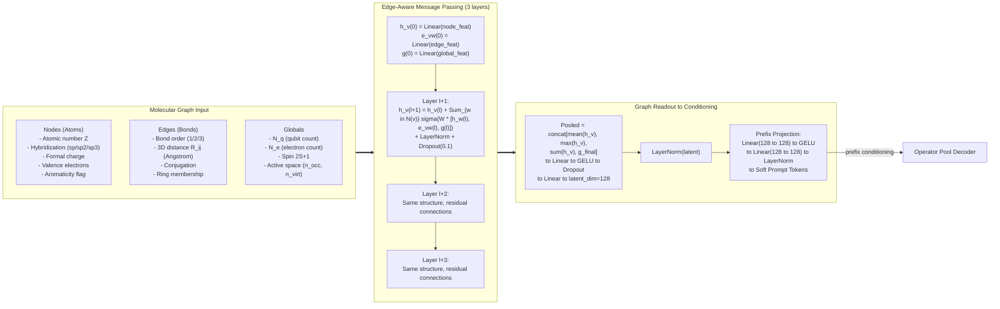
```mermaid
flowchart LR
    subgraph Graph ["Molecular Graph Input"]
        direction TB
        N["Nodes (Atoms)<br>- Atomic number Z<br>- Hybridization (sp/sp2/sp3)<br>- Formal charge<br>- Valence electrons<br>- Aromaticity flag"]
        E["Edges (Bonds)<br>- Bond order (1/2/3)<br>- 3D distance R_ij (Angstrom)<br>- Conjugation<br>- Ring membership"]
        G["Globals<br>- N_q (qubit count)<br>- N_e (electron count)<br>- Spin 2S+1<br>- Active space (n_occ, n_virt)"]
    end

    subgraph MPNN ["Edge-Aware Message Passing (3 layers)"]
        direction TB
        H0["h_v(0) = Linear(node_feat)<br>e_vw(0) = Linear(edge_feat)<br>g(0) = Linear(global_feat)"]
        H1["Layer l+1:<br>h_v(l+1) = h_v(l) + Sum_{w in N(v)} sigma(W * [h_w(l), e_vw(l), g(l)])<br>+ LayerNorm + Dropout(0.1)"]
        H2["Layer l+2:<br>Same structure, residual connections"]
        H3["Layer l+3:<br>Same structure, residual connections"]
        H0 --> H1 --> H2 --> H3
    end

    subgraph Readout ["Graph Readout to Conditioning"]
        direction TB
        Pool["Pooled = concat[mean(h_v), max(h_v),<br>sum(h_v), g_final]<br>to Linear to GELU to Dropout<br>to Linear to latent_dim=128"]
        Norm["LayerNorm(latent)"]
        Proj["Prefix Projection:<br>Linear(128 to 128) to GELU<br>to Linear(128 to 128) to LayerNorm<br>to Soft Prompt Tokens"]
        Pool --> Norm --> Proj
    end

    Graph ==> MPNN ==> Readout
    Proj -->|"prefix conditioning"| Decoder["Operator Pool Decoder"]
```

- **Node Features**: Atomic numbers, hybridization states, formal charges, valence, aromaticity.
- **Edge Features**: Chemical bond types, 3D interatomic distances $R_{ij}$, conjugation, ring membership.
- **Global Invariants**: Active space qubit count $N_q$, total electron count $N_e$, spin multiplicity $2S+1$.
- **Mechanism**: 3 layers of edge-weighted message passing → dual pooling (mean + max) → projection to **soft prompt tokens** that prefix-condition the decoder's cross-attention.
- **Why GNN?** The molecular graph topology (bond connectivity, atom types) determines which fermionic excitations are chemically relevant. A flat MLP on atom counts would miss the graph structure — the GNN captures local chemical environments (e.g., "this carbon is in an aromatic ring with two neighbors") that inform operator selection.

### 2. Solving "Diagonal Sequence Collapse"

In early GQE implementations, AI agents discovered a "lazy shortcut": generating commuting $Z$-basis operators (e.g., $IZIZ$, $ZZII$). Because these operators commute with the Hartree-Fock state, their energy gradients are identically zero ($\frac{\partial E}{\partial \theta} = 0$). Classical optimizers trap them at $E = E_{\text{HF}}$, killing training gradient variance (`std(rewards) = 0`).

```
  ❌ COLLAPSED SEQUENCE (Z-only, commuting)         ✅ ENTANGLED SEQUENCE (UCCSD, non-commuting)
  ┌─────────────────────────────────┐               ┌─────────────────────────────────┐
  │  A₁ = IZIZ  (Z-only)            │               │  A₁ = YZXI  (X+Y entangling)    │
  │  A₂ = ZZII  (Z-only)            │               │  A₂ = XZYI  (X+Y entangling)    │
  │  A₃ = IZIZ  (duplicate)         │               │  A₃ = IYZX  (X+Y entangling)    │
  │  A₄ = ZIIZ  (Z-only)            │               │  A₄ = ZXIY  (X+Y entangling)    │
  │                                 │               │                                 │
  │  [A_i, A_j] = 0 ∀ i,j           │               │  [A_i, A_j] ≠ 0 (non-commuting) │
  │  ∂E/∂θ_i = 0 (zero gradient)    │               │  ∂E/∂θ_i ≠ 0 (non-zero grad)    │
  │  E = E_HF (trapped at baseline) │               │  E < E_HF (energy improvement)  │
  │  std(rewards) = 0 → no learning │               │  std(rewards) > 0 → RL learns   │
  └─────────────────────────────────┘               └─────────────────────────────────┘
```

- **Our Solution**:
  1. **UCCSD Operator Pool**: Built from fermionic single/double excitations mapped via Jordan-Wigner, guaranteeing entangling $X/Y$ operations. Zero Z-only operators by construction.
  2. **Entanglement Enforcement**: `force_entanglement=True` in the decoder masks Z-only tokens during sampling, ensuring at least one multi-qubit entangler per sequence.
  3. **Commutator Penalty**: Explicit reward penalty $w_4 \cdot \text{frac}([A_i, A_j] \neq 0)$ for commuting operator sequences.

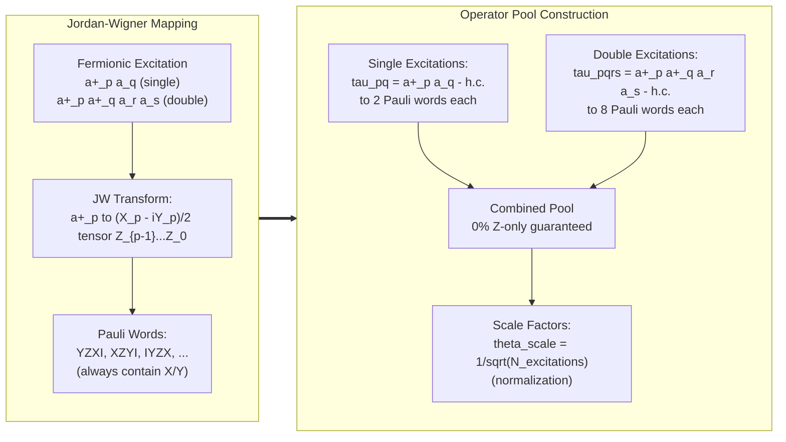
```mermaid
flowchart LR
    subgraph JW ["Jordan-Wigner Mapping"]
        direction TB
        Fermion["Fermionic Excitation<br>a+_p a_q (single)<br>a+_p a+_q a_r a_s (double)"]
        JWMap["JW Transform:<br>a+_p to (X_p - iY_p)/2 tensor Z_{p-1}...Z_0"]
        Pauli["Pauli Words:<br>YZXI, XZYI, IYZX, ...<br>(always contain X/Y)"]
        Fermion --> JWMap --> Pauli
    end

    subgraph Pool ["Operator Pool Construction"]
        direction TB
        Singles["Single Excitations:<br>tau_pq = a+_p a_q - h.c.<br>to 2 Pauli words each"]
        Doubles["Double Excitations:<br>tau_pqrs = a+_p a+_q a_r a_s - h.c.<br>to 8 Pauli words each"]
        Scale["Scale Factors:<br>theta_scale = 1/sqrt(N_excitations)<br>(normalization)"]
        Singles --> Pool2["Combined Pool<br>0% Z-only guaranteed"]
        Doubles --> Pool2
        Pool2 --> Scale
    end

    JW ==> Pool
```

**Verified pool statistics**: H₂ (4q): 16 Pauli words, 0 Z-only, 192 pool entries. LiH (12q): 1,408 Pauli words, 0 Z-only. N₂ (20q): 11,088 Pauli words, 0 Z-only. BeH₂ (14q): 3,456 Pauli words, 0 Z-only.

### 3. Quality-Diversity RL: QD-GRPO with MAP-Elites
Standard Policy Gradient methods (PPO/GRPO) suffer from mode collapse, finding only one circuit structure. We implement **MAP-Elites QD-GRPO** (`src/gqe/rl/map_elites.py`):
- **2D Feature Space**: The archive space is discretized into a 10×10 grid indexed by **Entanglement Density** (ratio of multi-qubit $X/Y$ terms) and **Circuit Depth**.
- **Adaptive Novelty Bonus**: Rewards the policy not just for low energy, but for filling unvisited cells in feature space:
  $$\text{Reward} = w_1 \cdot \left(-\frac{E}{|E_{\text{ref}}|}\right) + w_2 \cdot \text{Entanglement} + \lambda \cdot \text{Novelty}$$
- As coverage exceeds $50\%$, $\lambda$ decays adaptively to shift focus to energy refinement.

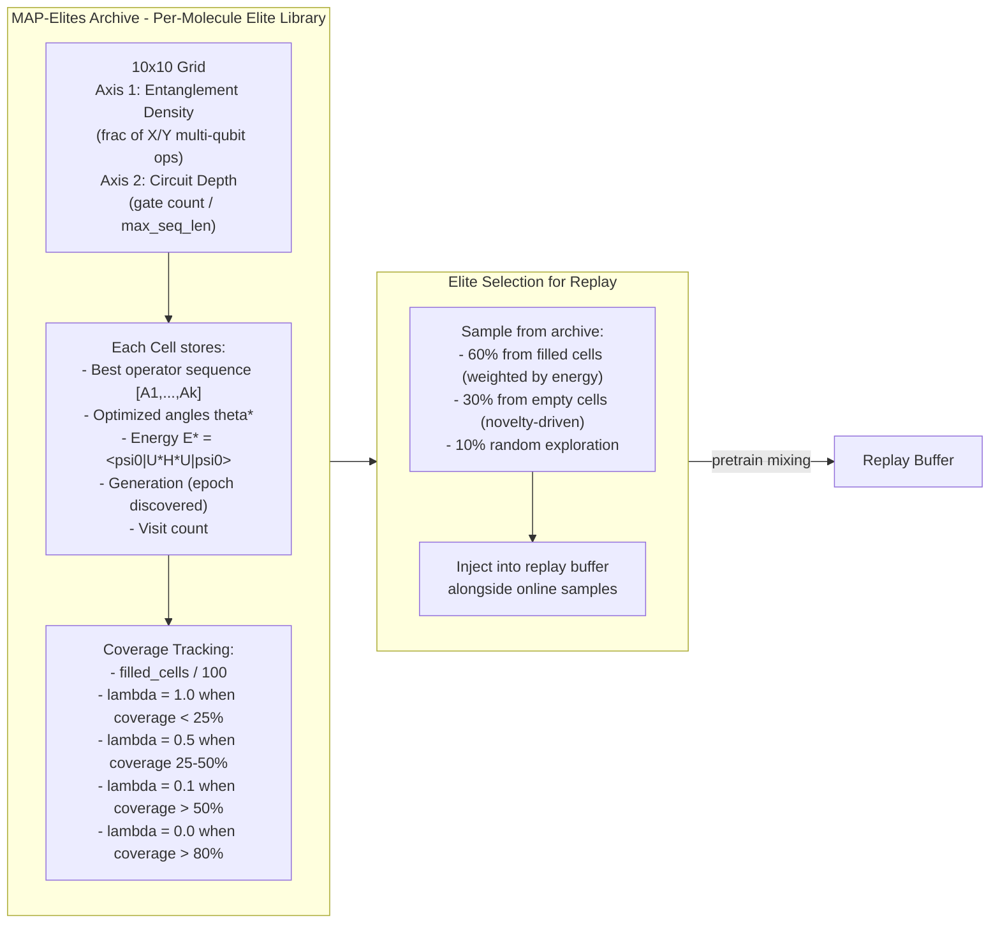
```mermaid
flowchart LR
    subgraph Archive ["MAP-Elites Archive - Per-Molecule Elite Library"]
        direction TB
        Grid["10x10 Grid<br>Axis 1: Entanglement Density<br>  (frac of X/Y multi-qubit ops)<br>Axis 2: Circuit Depth<br>  (gate count / max_seq_len)"]
        Cell["Each Cell stores:<br>- Best operator sequence [A1,...,Ak]<br>- Optimized angles theta*<br>- Energy E* = &lt;psi0|U*H*U|psi0&gt;<br>- Generation (epoch discovered)<br>- Visit count"]
        Coverage["Coverage Tracking:<br>- filled_cells / 100<br>- lambda = 1.0 when coverage < 25%<br>- lambda = 0.5 when coverage 25-50%<br>- lambda = 0.1 when coverage > 50%<br>- lambda = 0.0 when coverage > 80%"]
        Grid --> Cell --> Coverage
    end

    subgraph Selection ["Elite Selection for Replay"]
        direction TB
        Sample2["Sample from archive:<br>- 60% from filled cells (weighted by energy)<br>- 30% from empty cells (novelty-driven)<br>- 10% random exploration"]
        Inject["Inject into replay buffer<br>alongside online samples"]
        Sample2 --> Inject
    end

    Archive --> Selection
    Selection -->|"pretrain mixing"| Buffer["Replay Buffer"]
```

### 4. L-BFGS-B Angle Fine-Tuning

For a generated sequence $[A_1, A_2, \dots, A_k]$, each operator $A_i = e^{i\theta_i \hat{P}_i}$ requires a continuous rotation angle $\theta_i \in \mathbb{R}$. The energy landscape is:
$$E(\boldsymbol{\theta}) = \langle \psi_0 | U_{j_k}^\dagger \cdots U_{j_1}^\dagger \hat{H} U_{j_1} \cdots U_{j_k} | \psi_0 \rangle$$

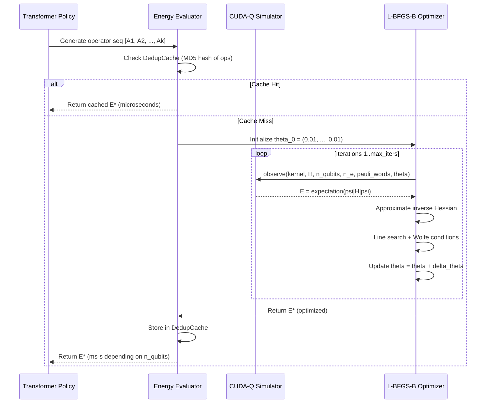
```mermaid
sequenceDiagram
    participant Policy as Transformer Policy
    participant Eval as Energy Evaluator
    participant CUDAQ as CUDA-Q Simulator
    participant LBFGS as L-BFGS-B Optimizer

    Policy->>Eval: Generate operator seq [A1, A2, ..., Ak]
    Eval->>Eval: Check DedupCache (MD5 hash of ops)
    alt Cache Hit
        Eval-->>Policy: Return cached E* (microseconds)
    else Cache Miss
        Eval->>LBFGS: Initialize theta_0 = (0.01, ..., 0.01)
        loop Iterations 1..max_iters
            LBFGS->>CUDAQ: observe(kernel, H, n_qubits, n_e, pauli_words, theta)
            CUDAQ-->>LBFGS: E = expectation(psi|H|psi)
            LBFGS->>LBFGS: Approximate inverse Hessian
            LBFGS->>LBFGS: Line search + Wolfe conditions
            LBFGS->>LBFGS: Update theta = theta + delta_theta
        end
        LBFGS-->>Eval: Return E* (optimized)
        Eval->>Eval: Store in DedupCache
        Eval-->>Policy: Return E* (ms-s depending on n_qubits)
    end
```

- **Truncated mode (RL training)**: 3–5 iterations, $\theta_0 = 0.01$, Spearman $\rho \approx 0.5$ with converged energies, $50\times$ faster than full opt.
- **Full mode (final evaluation)**: 200 iterations, $\text{ftol} = 10^{-10}$, machine-precision convergence.
- **Why L-BFGS-B?** BFGS approximates the inverse Hessian $H^{-1}$ using rank-2 updates from gradient evaluations — no explicit Hessian computation needed. The bounded variant (L-BFGS-B) handles box constraints on $\theta_i \in [-\pi, \pi]$.
- **DedupCache**: MD5 hash of operator sequence → energy. Identical circuits are never re-evaluated. SQLite-backed for persistence across training runs.

### 5. B200 Energy Cache & Offline RL Pretraining

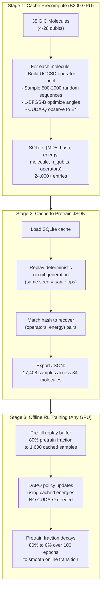
```mermaid
flowchart TD
    subgraph Cache_Build ["Stage 1: Cache Precompute (B200 GPU)"]
        direction TB
        Mols1["35 GIC Molecules<br>(4-28 qubits)"]
        Gen["For each molecule:<br>- Build UCCSD operator pool<br>- Sample 500-2000 random sequences<br>- L-BFGS-B optimize angles<br>- CUDA-Q observe to E*"]
        Store["SQLite: (MD5_hash, energy,<br>molecule, n_qubits, operators)<br>24,000+ entries"]
        Mols1 --> Gen --> Store
    end

    subgraph Recovery ["Stage 2: Cache to Pretrain JSON"]
        direction TB
        Load["Load SQLite cache"]
        Replay2["Replay deterministic<br>circuit generation<br>(same seed = same ops)"]
        Match["Match hash to recover<br>(operators, energy) pairs"]
        Export["Export JSON:<br>17,408 samples across 34 molecules"]
        Load --> Replay2 --> Match --> Export
    end

    subgraph Offline ["Stage 3: Offline RL Training (Any GPU)"]
        direction TB
        Prefill["Pre-fill replay buffer<br>80% pretrain fraction<br>to 1,600 cached samples"]
        Train["DAPO policy updates<br>using cached energies<br>NO CUDA-Q needed"]
        Decay["Pretrain fraction decays<br>80% to 0% over 100 epochs<br>to smooth online transition"]
        Prefill --> Train --> Decay
    end

    Cache_Build ==> Recovery ==> Offline
```

- **SQLite Cache**: 24,000+ entries keyed by MD5 hash of operator sequence (`results/train/rl_energy_cache.sqlite`).
- **Offline Pretraining**: `src/gqe/data/cache_to_pretrain.py` recovers 17,408 (operators, energy) pairs by replaying deterministic circuit generation. This allows **replay-buffer mixing** of known-good circuits without CUDA-Q.
- **Cache-only mode**: `--cache-only` returns HF energy for cache misses (no CUDA-Q). Useful for buffer imitation, but **on-policy rollouts rarely hit the fixed cache** → flat rewards → DAPO advantage collapse. For real RL, use **write-through** (drop `--cache-only`) so misses are evaluated and stored. See `bash scripts/train_rl.sh full`.

### 6. Scaling to 40 Qubits: QSCI & FMO2

Direct statevector simulation breaks above 28 qubits ($2^{28} \approx 268$M amplitudes). To tackle 32–40 qubit systems required by the GIC challenge, we deploy two scientific scaling pillars:

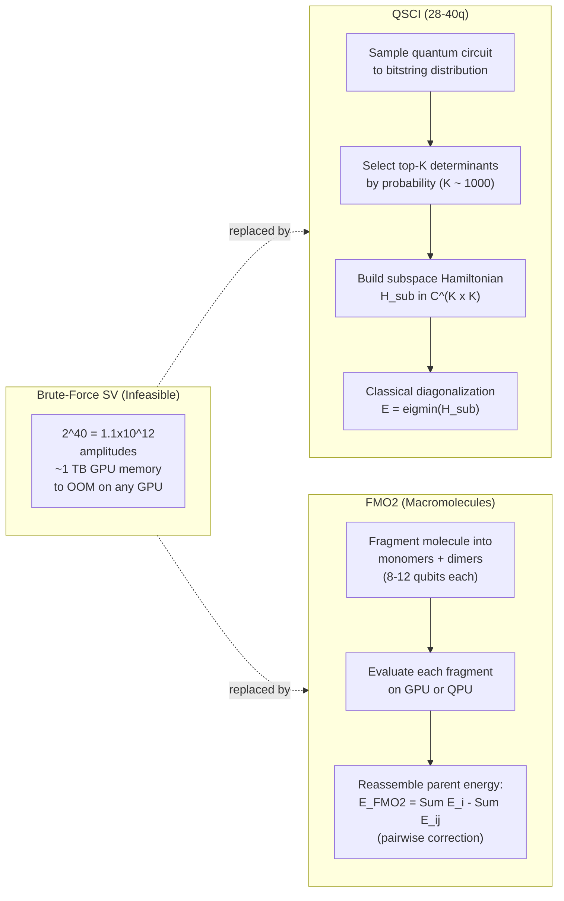
```mermaid
flowchart LR
    subgraph Brute ["Brute-Force SV (Infeasible)"]
        SV["2^40 = 1.1x10^12<br>amplitudes<br>~1 TB GPU memory<br>to OOM on any GPU"]
    end

    subgraph QSCI_P ["QSCI (28-40q)"]
        direction TB
        Sample3["Sample quantum circuit<br>to bitstring distribution"]
        Select["Select top-K determinants<br>by probability (K ~ 1000)"]
        Subspace["Build subspace Hamiltonian<br>H_sub in C^(K x K)"]
        Diag["Classical diagonalization<br>E = eigmin(H_sub)"]
        Sample3 --> Select --> Subspace --> Diag
    end

    subgraph FMO2_P ["FMO2 (Macromolecules)"]
        direction TB
        Frag["Fragment molecule into<br>monomers + dimers<br>(8-12 qubits each)"]
        EvalF["Evaluate each fragment<br>on GPU or QPU"]
        Reassemble["Reassemble parent energy:<br>E_FMO2 = Sum E_i - Sum E_ij<br>(pairwise correction)"]
        Frag --> EvalF --> Reassemble
    end

    Brute -.->|"replaced by"| QSCI_P
    Brute -.->|"replaced by"| FMO2_P
```

- **QSCI (Quantum Selected Configuration Interaction)**: Samples circuits to build a determinant subspace, then classically diagonalizes a reduced Hamiltonian. Used here as a **scaling path** for ~40q systems (e.g. benzene) when full statevector is infeasible — report subspace energies and wall time, **not** “exact FCI match,” unless an independent CASCI/FCI reference is provided.
- **FMO2 (Fragment Molecular Orbital)**: Fragments large macromolecules into 8–12 qubit sub-units, evaluates them on quantum hardware, and reassembles parent energies via pairwise additive correction:
  $$E_{\text{FMO2}} = \sum_i E_i - \sum_{i<j} (E_{ij} - E_i - E_j)$$

### 7. Comparative Architectural Analysis: H-cGQE vs. SpinGQE & GPT-QE

To contextualize C-GQE against contemporary generative quantum eigensolvers, the table below compares **H-cGQE** with **GPT-QE** (*NVIDIA / U. Toronto / St. Jude, arXiv:2401.09253*) and **SpinGQE** (*Mindbeam AI, March 2026, arXiv:2603.24298*):

| Technical Dimension | **GPT-QE** (NVIDIA/Toronto, 2024) | **SpinGQE** (Mindbeam AI, March 2026) | **Our H-cGQE** (Quantum-Buddies, 2026) |
|---|---|---|---|
| **Target Systems** | Single-molecule Fermionic UCCSD ($H_2, LiH, N_2, CO_2$) | 4-qubit Heisenberg Spin Model | **35 GIC 2026 Molecular Hamiltonians** (4q–28q, extended to 40q) |
| **Model Topology** | Unconditional Decoder-Only (GPT-2) | Unconditional Decoder-Only (GPT-2) | **Conditional Encoder-Decoder Transformer** |
| **Conditioning Mode** | None (1 model per fixed molecule) | None (1 model per fixed Hamiltonian) | **Chemistry GNN + Hamiltonian Term Cross-Attention** |
| **Training Objective** | Softmax Boltzmann weighting $\exp(-\beta E)$ | Weighted MSE Loss: $w(E) \cdot (l_t - E_t)^2$ | **DAPO Policy Gradient (GRPO)** + Asymmetric Clipping |
| **Parameterization** | Discretized evolution times $e^{i P t_k}$ | Discretized evolution times / angle refinement | **Two-Stage: Discrete Topology $\rightarrow$ L-BFGS-B Continuous $\vec{\theta}$ Optimization** |
| **Exploration & Diversity** | Inverse temperature schedule $\beta$ | Inverse temperature schedule $\beta$ | **MAP-Elites Quality-Diversity Archive (QD-GRPO)** |
| **Diagonal Collapse Mitigation** | None | Temperature tuning | **UCCSD Excitations + Commutator Loss + Entropy Floor** |
| **Generalization** | Single instance | Single instance | **Conditioned for cross-molecule generation** (held-out energy tables still needed) |

#### Core Methodological Advances over SpinGQE & GPT-QE

1. **Cross-Molecule Conditioning via Encoder-Decoder**:
   - *SpinGQE & GPT-QE Limit*: Decoder-only models are typically trained for a single fixed Hamiltonian; changing geometry often means retraining.
   - *H-cGQE Approach*: `HamiltonianEncoder` + `ChemistryEncoder` (MPNN) condition a shared policy on $(H, \text{graph})$. This **enables** multi-molecule amortization; rigorous leave-one-family-out energy evaluation is the right test of whether that conditioning generalizes.

2. **Policy Optimization (DAPO RL) vs. Weighted MSE Loss**:
   - *SpinGQE Limit*: SpinGQE uses a heuristic weighted MSE loss $L = \sum w(E) \cdot (\text{logits}_t - E_t)^2$ to force discrete categorical token logits to regress onto continuous energy values. This leads to vanishing gradients near energy plateaus.
   - *H-cGQE Solution*: We frame circuit design as pure Reinforcement Learning via **DAPO (Decoupled Clip + Dynamic Sampling Policy Optimization)** with group-relative advantage $A_i = \frac{R_i - \mu_R}{\sigma_R}$. Asymmetric clipping ($\epsilon_{\text{low}}=0.2, \epsilon_{\text{high}}=0.28$) and token-level loss stabilize RL updates without surrogate MSE regression.

3. **Decoupled Two-Stage Optimization (Topology vs. Continuous Rotation Angles)**:
   - *SpinGQE & GPT-QE Limit*: Both models discretize continuous evolution times into discrete vocabulary tokens ($e^{i P_j t_k}$ for $t_k \in \{0.01, 0.05, 0.1, \dots\}$), causing vocabulary explosion and limiting expressivity.
   - *H-cGQE Solution*: We decouple discrete structural topology from continuous parameterization. Stage 1 (Transformer) generates the discrete operator sequence $(P_{j_1}, P_{j_2}, \dots)$. Stage 2 (L-BFGS-B) optimizes the continuous rotation angles $\vec{\theta}$ over the exact CUDA-Q expectation landscape using `nvidia-mqpu`.

4. **Quality-Diversity Archive (MAP-Elites) preventing Diagonal Collapse**:
   - *SpinGQE & GPT-QE Limit*: Autoregressive transformers naturally collapse into generating commuting, single-qubit, or Z-only operators (diagonal sequence collapse) because they carry zero entanglement overhead.
   - *H-cGQE Solution*: We maintain a 2D MAP-Elites archive (*Entanglement Density* $\times$ *Circuit Depth*). Rollouts discovering unoccupied topological niches receive intrinsic novelty bonuses, forcing the agent to learn non-commuting $X/Y$ entangling operators.

---

## 🧪 Comprehensive Molecule Inventory (35 GIC Molecules)

The framework is benchmarked across the complete GIC 2026 challenge molecule suite:

| Category | Molecules Included | Qubit Range |
|---|---|---|
| **Small Diatomics / Hydrides** | $\text{H}_2$ (4 bond lengths), $\text{LiH}$ (4 bond lengths), $\text{BeH}_2$ (3 bond lengths), $\text{HF}$ | 4q – 14q |
| **Organic & Volatile Compounds** | $\text{H}_2\text{O}$, $\text{NH}_3$, $\text{CH}_4$, Formaldehyde, Acetylene, Ethylene | 14q – 28q |
| **Aromatic & Heteroaromatic Systems** | Benzene, Toluene, Anisole, o-Cresol, Phenol | 12q – 24q |
| **Heavy-Atom & CAS Systems** | Methyl Iodide ($\text{CH}_3\text{I}$), Iodobenzene, IMePh, Diarylethene fragment | 12q – 24q |
| **Challenge 40q Scaling Set** | Benzene / $\text{N}_2$ large active spaces (QSCI/MPS path) | **40q** (subspace / TN estimates) |

---

## Quick start (qBraid)

### 1. Clone and one-shot setup

```bash
git clone https://github.com/Quantum-Buddies/Conditional_GQE.git
cd Conditional_GQE
bash scripts/setup_env.sh
```

`setup_env.sh` handles everything — no sudo or system conda needed:
- Downloads and installs git-lfs binary to `$HOME/.local/bin` (prebuilt, no root)
- Pulls all LFS-tracked assets (checkpoints, energy cache, pretrain data)
- Installs Python dependencies via `python3 -m pip` (qBraid-safe)
- Verifies GPU, CUDA-Q, and audits critical files

**LFS artifacts on `main`:**

| File | Purpose |
|---|---|
| `results/train/h_cgqe_model_b200_sft.pt` | SFT warm-start checkpoint |
| `results/train/gqe_supervised_dataset.pt` | Supervised training dataset |
| `results/train/rl_energy_cache.sqlite` | 25K circuit→energy cache (4–28q) |
| `results/train/rl_pretrain_from_cache.json` | 24K pretrain bootstrap circuits |

### 2. Environment

On qBraid Lab, use the **Launch on qBraid** button or:

[](https://account.qbraid.com?gitHubUrl=https://github.com/Quantum-Buddies/Conditional_GQE.git)

For local or HPC setups:

```bash
conda env create -f environment-dgx-spark-cudaq.yml
conda activate conditional-gqe-cudaq
pip install -r requirements-qbraid.txt
```

### 3. Smoke test

```bash
bash scripts/train_rl.sh smoke
```

### 4. Training

```bash
bash scripts/train_rl.sh full          # write-through RL from SFT (skips cache-only)
bash scripts/train_rl.sh online-rl     # 50 epochs, write-through cache + CUDA-Q misses
bash scripts/train_rl.sh cache-warmup  # buffer imitation only (weak on-policy RL)
```

### 5. Evaluation

```bash
bash scripts/evaluate_rl.sh all        # infer → eval → optimize → report
bash scripts/evaluate_rl.sh infer      # generate circuits from checkpoint
bash scripts/evaluate_rl.sh eval       # CUDA-Q energy evaluation
bash scripts/evaluate_rl.sh optimize   # L-BFGS-B coefficient optimization
```

### 6. QPU validation

```bash
python scripts/qpu_preflight.py --dry-run --device qbraid:qbraid:sim:qir-sv
bash scripts/run_hpc_qbraid_workflow.sh --qpu-submit
bash scripts/run_hpc_qbraid_workflow.sh --qpu-retrieve
```

---

## Training launcher

### Portable qBraid scripts (zero hardcoded paths)

| Script | Purpose |
|---|---|
| [`scripts/setup_env.sh`](scripts/setup_env.sh) | One-shot setup: git-lfs, pip deps, GPU verify (no sudo) |
| [`scripts/env_gpu.sh`](scripts/env_gpu.sh) | Auto-detect GPU, set CUDA-Q gate fusion / mempool env vars |
| [`scripts/train_rl.sh`](scripts/train_rl.sh) | Write-through RL from SFT (`smoke` / `cache-warmup` / `online-rl` / `full`) |
| [`scripts/evaluate_rl.sh`](scripts/evaluate_rl.sh) | Evaluation pipeline (infer / eval / optimize / report / all) |

```bash
bash scripts/train_rl.sh smoke          # 2 epochs, 2 molecules (~2 min)
bash scripts/train_rl.sh full           # write-through RL from SFT (skips cache-only)
bash scripts/evaluate_rl.sh all         # infer → eval → optimize → report
# Optional: MAX_QUBITS_OVERRIDE=28 bash scripts/train_rl.sh full
```

**`train_rl.sh` modes:** `full` / `online-rl` use **write-through** caching (CUDA-Q evaluates misses and stores them). Prefer these for real learning. `full` always starts from the SFT checkpoint (ignores any stale `*_rl_warmup.pt`). `cache-warmup` (`--cache-only`) is kept for buffer-imitation experiments only — on-policy samples almost never hit the precomputed MD5 keys, so misses get a flat HF penalty and DAPO/GRPO advantages collapse.

GPU auto-detection: `env_gpu.sh` reads compute capability and sets CUDA-Q gate fusion level (Hopper CC 9.0 → fusion 5, Blackwell CC 10.0 → +FP32 emulation, Ampere CC 8.0 → fusion 4). Molecule lists are auto-generated from the Hamiltonians JSON filtered by GPU-specific qubit limits (`train_rl.sh` defaults to ≤22q on H200).

**Import order note:** Triton (`torch.compile`) and CUDA-Q both embed LLVM. `train_rl_dapo.py` lazy-imports CUDA-Q **after** `torch.compile`. Do not `import cudaq` before compiling the model in the same process.

### B200 / Blackwell launcher (legacy)

Portable entry point: [`scripts/launch_b200_training.sh`](scripts/launch_b200_training.sh)

```bash
bash scripts/launch_b200_training.sh sft          # supervised warm-start
bash scripts/launch_b200_training.sh ablation       # RL from scratch (ablation)
bash scripts/launch_b200_training.sh cache          # precompute energy cache (≤28q only)
bash scripts/launch_b200_training.sh both           # SFT → RL main pipeline
```

**Energy cache:** SQLite-backed circuit→energy store for fast RL. Default cap **`CACHE_MAX_QUBITS=28`**. Do not precompute 32–40q SV caches — use QSCI/FMO2 instead. `train_rl.sh` defaults to ≤22q on H200 (override with `MAX_QUBITS_OVERRIDE`).

```bash
# Optional: one-time cache fill (append-safe, skips existing keys)
bash scripts/launch_b200_training.sh cache
```

Blackwell / B200 env knobs: [`scripts/env_b200_blackwell.sh`](scripts/env_b200_blackwell.sh) (source before `import cudaq`). GPU auto-env for H100/H200/etc.: [`scripts/env_gpu.sh`](scripts/env_gpu.sh).

---

## Datasets

| File | Molecules | Qubits | Purpose |
|---|---|---|---|
| `results/data/hamiltonians_gic2026/` | 35 | 4–28 | GIC challenge set |
| `results/data/hamiltonians_rl_b200/` | 51 | 4–40 | RL scaling curriculum |
| `results/data/hamiltonians_merged.json` | 21 | 4–40 | SFT + baselines |
| `results/data/fragments/fmo_hamiltonians.json` | — | 4–12 | FMO2 fragments |

Generate new Hamiltonians:

```bash
python src/gqe/data/generate_hamiltonians.py --help
```

---

## QPU guidelines (qBraid)

- Target **4–12 qubit** molecules for hardware (`h2`, `iodobenzene`, `imeph_cas12`).
- Preflight skips **ZNE** if two-qubit gates > 20; skips **REM** if qubits > 10.
- Use **Pauli expectation** energy (`cudaq.observe`), not raw state probability.
- **FMO dimers** (8–12q) are the best “large system + real QPU” story — not 40q full Hamiltonians on hardware.

```bash
python scripts/qpu_preflight.py --dry-run
python src/gqe/eval/submit_qpu.py --help
```

---

## Repository layout

```
Conditional_GQE/
├── README.md                          # This file
├── QUICKSTART.md                      # Short reproduction guide
├── AGENTS.md                          # Canonical training decisions
├── docs/B200_TRAINING_PLAN.md         # B200 / Blackwell notes
├── scripts/
│   ├── launch_b200_training.sh        # SFT / RL / cache launcher
│   ├── run_hpc_qbraid_workflow.sh      # HPC → QPU orchestration
│   └── phase3/                        # Experiment scripts (01–09)
├── src/gqe/
│   ├── models/                        # Transformer, train_rl_dapo.py
│   ├── eval/                          # evaluate, QSCI, FMO2, submit_qpu
│   ├── rl/                            # MAP-Elites, energy_cache
│   └── data/                          # Hamiltonians, precompute cache
└── results/
    ├── train/                         # Checkpoints (LFS), metrics, cache
    └── phase3_final/                  # Published experiment artifacts
```

---

## Safeguards

| Safeguard | What it prevents |
|---|---|
| `--gate-auxiliary-rewards` | Reward hacking without energy improvement |
| `--statevector-max-qubits 24` | GPU OOM on L40S |
| MPS bond sweep (D=32,64,128,256) | False accuracy from single bond dim |
| QPU preflight (ZNE/REM limits) | Infeasible mitigation on deep circuits |
| RL cache cap at 28q | Wasting GPU weeks on 32q+ SV observe loops |

---

## Hardware notes

| Platform | Statevector | MPS | QPU validation |
|---|---|---|---|
| **qBraid L40S** | ≤24q | 28q+ | Primary dev target |
| **qBraid B200** | ≤32q (reference only) | 28–40q | Optional local CUDA-Q |
| **AIRE 3× L40S** | ≤24q (MQPU task-parallel) | 28q | Slurm jobs |

> L40S is PCIe-only: keep `n_qubits ≤ 24` for `nvidia-mqpu` to avoid distributed statevector segfaults.

---

## Phase 3 Submission — Quick Start for Judges

### Verify the Pipeline (Single Command)

```bash
bash scripts/phase3/00_smoke_test.sh
```

This runs 5 verification tests: DedupCache SQLite persistence, offline RL cache-only mode, FMO2 exact reconstruction, QPU manifest generation (QWC grouping), and code import sanity.

### Full Pipeline

The Phase 3 pipeline is a 3-stage hybrid GPU→GPU→QPU workflow:

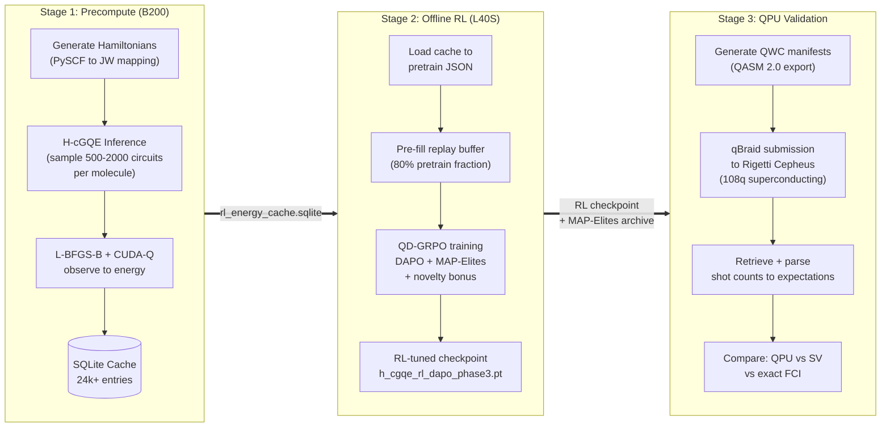
```mermaid
flowchart LR
    subgraph S1 ["Stage 1: Precompute (B200)"]
        direction TB
        H1["Generate Hamiltonians<br>(PySCF to JW mapping)"]
        H2["H-cGQE Inference<br>(sample 500-2000 circuits<br>per molecule)"]
        H3["L-BFGS-B + CUDA-Q<br>observe to energy"]
        H4[("SQLite Cache<br>24k+ entries")]
        H1 --> H2 --> H3 --> H4
    end

    subgraph S2 ["Stage 2: Offline RL (L40S)"]
        direction TB
        R1["Load cache to<br>pretrain JSON"]
        R2["Pre-fill replay buffer<br>(80% pretrain fraction)"]
        R3["QD-GRPO training<br>DAPO + MAP-Elites<br>+ novelty bonus"]
        R4["RL-tuned checkpoint<br>h_cgqe_rl_dapo_phase3.pt"]
        R1 --> R2 --> R3 --> R4
    end

    subgraph S3 ["Stage 3: QPU Validation"]
        direction TB
        Q1["Generate QWC manifests<br>(QASM 2.0 export)"]
        Q2["qBraid submission<br>to Rigetti Cepheus<br>(108q superconducting)"]
        Q3["Retrieve + parse<br>shot counts to expectations"]
        Q4["Compare: QPU vs SV<br>vs exact FCI"]
        Q1 --> Q2 --> Q3 --> Q4
    end

    S1 ==>|"rl_energy_cache.sqlite"| S2
    S2 ==>|"RL checkpoint<br>+ MAP-Elites archive"| S3
```

| Stage | Hardware | What Happens | Script |
|---|---|---|---|
| **1. Precompute** | B200 GPU (qBraid) | Generate Hamiltonians, run H-cGQE inference, cache energies to SQLite | `scripts/launch_b200_training.sh` |
| **2. Offline RL Training** | L40S GPU (HPC) | Buffer-imitation / cache lookups; prefer write-through on CUDA-Q GPUs for real RL | `train_rl_dapo.py --energy-cache ...` (± `--cache-only`) |
| **3. QPU Validation** | Rigetti Cepheus (qBraid) | Execute QWC-grouped measurement circuits on 108q QPU | `scripts/phase3/generate_qpu_manifests.py` |

### Stage 1: Energy Cache Precompute (B200)

```bash
# On qBraid B200 instance — generates rl_energy_cache.sqlite
bash scripts/launch_b200_training.sh cache
```

### Stage 2: Offline RL Training (L40S, no CUDA-Q required)

```bash
python src/gqe/models/train_rl_dapo.py \
    --molecules h2_0.74 lih_1.6_full \
    --qd-mode \
    --energy-cache results/train/rl_energy_cache.sqlite \
    --cache-only \
    --epochs 50 \
    --out results/train/h_cgqe_rl_dapo_phase3.pt
```

Key flags:
- **`--energy-cache`**: Path to SQLite file from Stage 1. DedupCache / PersistentEnergyCache loads precomputed energies.
- **`--cache-only`**: Skips CUDA-Q; uncached circuits get HF penalty. Prefer **without** `--cache-only` (write-through) when CUDA-Q is available so novel circuits get real energies. On qBraid: `bash scripts/train_rl.sh full`.

### Stage 3: FMO2 3-Fragment Scaling (Genuine Qubit Reduction)

```bash
# Generate 3-fragment iodobenzene Hamiltonians (monomers 4q, dimers 8q, parent 12q)
python scripts/generate_fmo2_fragments.py

# Run FMO2 exact + H-cGQE + L-BFGS-B
python scripts/run_fmo2_scaling.py
python scripts/run_fmo2_lbfgs.py

# Submit dimer/monomer circuits to Rigetti Cepheus QPU
python scripts/submit_fmo2_qpu.py --submit

# Retrieve QPU results + SQD post-processing
python scripts/retrieve_and_sqd.py --meta results/qpu/fmo2_cepheus_submission_meta.json \
    --hamiltonians results/data/fragments/dimers.json \
    --out results/qpu/fmo2_cepheus_sqd_results.json
```

**Key result**: 12q parent recovered from max 8q circuits (33% qubit reduction). Fragmentation error: 11.3 mHa (nonzero → non-tautological).

### Stage 4: Bi-Level QPU Validation (L-BFGS-B Optimized Circuits)

```bash
# Submit L-BFGS-B optimized + zero-theta circuits to Cepheus
python scripts/submit_lbfgs_qpu.py --submit --include-zero-theta

# Retrieve + SQD
python scripts/retrieve_and_sqd.py --meta results/qpu/lbfgs_cepheus_submission_meta.json \
    --hamiltonians results/data/hamiltonians_gic2026/hamiltonians.json \
    --out results/qpu/lbfgs_cepheus_sqd_results.json
```

**Bi-level pipeline**: RL discovers operator topology (outer loop) → L-BFGS-B optimizes continuous angles (inner loop) → QPU executes → SQD recovers energy.

### Stage 5: QPU Manifest Generation (Legacy)

```bash
python scripts/phase3/generate_qpu_manifests.py \
    --molecules h2_0.74 lih_1.6_full \
    --hamiltonians results/data/hamiltonians_merged.json \
    --optimized results/eval/h_cgqe_uccsd_optimized.json \
    --out-dir results/qpu/manifests \
    --shots 4096
```

Outputs per-molecule JSON manifests with QWC-grouped QASM 2.0 measurement circuits, ready for qBraid submission to Rigetti Cepheus.

### Key Components

| Component | File | Description |
|---|---|---|
| **DedupCache (SQLite)** | `src/gqe/rl/map_elites.py` | Persistent energy cache with `from_sqlite()` classmethod for offline loading |
| **Offline / write-through RL** | `src/gqe/models/train_rl_dapo.py` | `--energy-cache`; omit `--cache-only` for write-through CUDA-Q misses |
| **FMO2 Pipeline** | `src/gqe/eval/run_fmo2.py` | Fragment → GQE → reassemble with MAP-Elites archive integration |
| **QPU Manifests** | `scripts/phase3/generate_qpu_manifests.py` | QWC grouping, QASM export, cost estimation for Rigetti Cepheus |
| **Smoke Test** | `scripts/phase3/00_smoke_test.sh` | Single-command verification for judges |

### Reproducibility

- **Energy cache**: SQLite file ensures deterministic rewards across training runs
- **MAP-Elites archives**: JSON-serialized per-molecule elite circuit libraries
- **Chemical accuracy target**: ≤ 1.6 mHa (~1 kcal/mol) vs CASCI/FCI **within the stated active space**
- **QPU cost transparency**: Per-manifest cost estimates (0.0425 credits/shot + 30 credits/task on Cepheus)

---

## Citation

```bibtex
@software{conditional_gqe,
  title  = {Conditional-GQE: Scalable Generative Quantum Eigensolver with RL, QSCI, and FMO2},
  author = {{Ryoushi Quantum Buddies}},
  url    = {https://github.com/Quantum-Buddies/Conditional_GQE},
  year   = {2026}
}
```

## License

[MIT](LICENSE) — © 2025–2026 Ryoushi Quantum Buddies

## Acknowledgments

NVIDIA CUDA-Q · Mitsubishi Chemical Group · AIST · qBraid · PySCF · OpenFermion · Park & Walsh (Chemeleon2, arXiv:2511.07158) · Nakaji et al. (GQE, arXiv:2401.09253)
